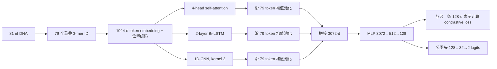

# Recognition of cyanobacteria promoters via Siamese network-based contrastive learning under novel non-promoter generation

## 阅读导航

- `mode: standard`
- `status: partial`
- 推荐读法：第一次阅读按第 1–8 节顺序进行；已了解启动子识别背景时，可从“2. 三分钟看懂”开始；只关心模型实现时，读第 4、5 节后直接进入第 7 节。
- 作者主线：传统负样本过于容易，使模型可能依赖 GC 含量和经典启动子外观等捷径；作者因此构造更接近正例的 phantom non-promoter，再用 Siamese contrastive learning 学习更有区分力的序列表征。
- 审查入口：第 7 节集中检查 phantom 数据是否实现了论文描述的构造、公开训练流程是否对应 10-fold cross-validation、所谓独立负例能否代表真实场景，以及 `GCGATCGC` 是否真是新的启动子 motif。
- 论文与代码：论文为 *Briefings in Bioinformatics* 25(3), bbae193，DOI `10.1093/bib/bbae193`；代码主要核查提交 `6b34869a1104a42acd215d5e4b47a720b357eb10`，并确认核心训练代码截至 `21e042ec5d3f47d647d9dd18022a0a5ef1715125` 未改变。
- 结论性缺口：仓库没有四种负样本生成脚本、完整 10 折实验驱动程序、基线复现实验或 motif 分析代码，因而不能从公开材料端到端复现论文全部结果。最小补全材料是负样本生成脚本、逐折索引、全部实验配置与 motif 分析实现。
- 生成文件：`deep-reading.md`、`evidence-ledger.md`。

## 1. 先把论文放回领域里

本文的机器学习任务是：输入一条 81 bp DNA 序列，输出 promoter 或 non-promoter 标签。启动子是转录起始时被 RNA 聚合酶及相关因子识别和结合的 DNA 区域；转录起始位点（transcription start site, TSS）则是 RNA 转录开始的具体碱基坐标，通常记作 +1。二者相关但不是同一个概念：本文用候选 TSS 作为坐标锚点截取 −60…+20 的窗口来构造正样本，但模型并不负责寻找 TSS，也不直接测量转录是否发生。〔E01–E02〕

可靠识别一段 DNA 是否具有启动子特征，可以辅助基因调控研究和合成生物学设计。这里还要区分“数据标签”和“生物学事实”：论文把候选 TSS 周围的窗口标作 promoter 正例，这是训练数据的构造方式；一条序列在实验条件下是否真正具有启动活性，则是更强的功能性问题。后文会先按论文的二分类任务解释模型，再在第 7 节审查标签证据能够支持到哪里。〔E02、E21〕

这类任务最棘手的地方不是缺少正例模式，而是缺少定义清楚的负例。候选 TSS 对齐窗口可被论文用作正样本，但“某段序列是 non-promoter”通常不能通过一次未观察到转录的实验完整证明：它可能只是在特定条件下没有被检测到，也可能含有尚未注释的替代启动子。因此，研究通常使用随机序列、编码区（coding sequence, CDS）片段或人工修改的正例作为代理负样本。模型最终学到什么，会直接受到这些代理负样本怎样生成的影响。〔E03–E04〕

如果负样本与正样本差得太明显，模型就可能找到并不对应真实部署任务的简单判别规则。例如，随机序列可能没有细菌启动子常见的 −10 Pribnow box，CDS 片段的 GC 分布也可能与 TSS 邻域不同。此时即使一个简单分类器得到很高分，也只能说明两套人工数据容易区分，不能自动说明它能在真实基因组中排除那些“外观像启动子、实际功能未知”的困难片段。作者据此把论文的切入口放在负样本构造，而不是先扩大模型。〔E04、E13〕

作者提出的 phantom sampling 试图让负例保留正例中的显眼特征：以一条启动子为模板，保留 −10 区和 TSS 附近碱基，随机化其余片段，并控制两条序列的 GC 差异。这样构造出的负例在表面上更像正例，分类器就需要利用更细的序列关系。随后，Siamese network 通过监督式对比学习把同类序列表征拉近、异类表征推远，再由分类头完成最终判断。〔E04、E09–E12〕

因此，这篇论文其实同时研究两个彼此依赖的问题：怎样构造不容易被简单捷径识别的非启动子，以及在这种更困难的正负分布上怎样学习表征。理解全文时，应把 phantom sampling 看作对“任务本身”的改造，把 SiamProm 看作对“新任务难度”的模型响应；二者共同构成作者的贡献主线。

## 2. 三分钟看懂这篇论文

论文直接做的是 81 bp DNA 序列的 promoter/non-promoter 二分类。它进一步想回答：如果过去的高分主要来自过于简单的负样本，那么能否先制造更像启动子的困难负例，再用对比学习逼迫模型寻找更细的差异？作者以 Anabaena/Nostoc sp. PCC 7120 的候选 TSS 为锚点截取 13,705 个窗口，经 80% CD-HIT-EST 去冗余后将 12,566 条序列作为正例；随后分别构造 random、CDS、partial substitution 和 phantom 四套负例。论文描述的 phantom 负例保留 −10 区与 TSS，对其余片段中的 7/10 进行随机化，并将 GC 差控制在 5% 以内。〔E02、E04–E07〕

模型把每条 81 nt 序列切成 79 个重叠 3-mer。每个 token 变成 1024 维向量后，同时进入 self-attention、双向 LSTM 和 1D-CNN 三条路径，分别汇总全局 token 关系、双向顺序上下文和局部邻域模式；三路结果经均值池化后拼接，再压缩为 128 维序列表征。训练时，两条序列共用同一编码器：contrastive loss 决定表征空间中谁应该靠近、谁应该至少相隔 margin；分类头则把单条序列的 128 维表征映射成 promoter/non-promoter logits。〔E09–E12〕

作者的实验故事与这个设计顺序一致。SVM 在 random 和 CDS 数据上分别达到 90.22% 和 88.54% accuracy，换到 phantom 后降至 78.33%，说明新的负例确实让所有模型面对更难的区分任务。在 phantom 数据的报告结果中，SiamProm 达到 88.74% accuracy 和 0.7754 MCC，高于论文比较的四个模型；去掉 Siamese 表征阶段后，accuracy 降为 82.66%，MCC 降为 0.6531。作者还在 34 条 pseudo-promoter 上报告 88.23% specificity，并通过 attention 与序列频次分析提出 `GCGATCGC` 是潜在的新 motif。〔E13–E17〕

**证据边界：** 公开 phantom 数据在 TSS 保留和逐对 GC 约束上与论文描述不一致，公开训练入口执行一次 90/10 随机划分而不是 10-fold cross-validation；34 条测试序列来自同一基因组 CDS 的规则筛选；外部文献早已把 `GCGATCGC` 记录为蓝藻高频回文 HIP1。上述事实是理解论文必须知道的边界，其对中心结论的影响统一在第 7 节评估。〔E03、E05–E08、E18–E21〕

**审查预告：** 第 7 节最核心的问题不是“SiamProm 有没有报告出更高分”，而是这些分数和 motif 分析究竟在多大程度上反映启动子识别，而不是负样本生成方式留下的类别特征。

## 3. 作者是怎样一步步想到这个方法的

### 3.1 先怀疑任务，而不是先怀疑模型

作者首先比较不同负样本构造下的分类难度。random 和 CDS 负例与真实 TSS 邻域在碱基组成和经典启动子外观上存在明显差异，简单 SVM 已能取得接近 90% 的 accuracy。这促使作者提出一个关键假设：旧基准中的一部分性能来自负样本过于容易，而不是模型真正识别到了更细的启动子模式。〔E04、E13〕

这个判断自然导向 phantom sampling。它不是为了模拟某一种已知生物学非启动子，而是想构造“保留已知强特征、但类别设为负”的困难对照。按照论文描述，一条正例和它的 phantom 负例共享 −10 Pribnow box 与 TSS 两个位置，其余区域被分块并部分随机化，同时约束整体 GC 差。作者希望借此封住最直接的判别线索，使模型必须使用剩余的序列结构。〔E04–E05〕

### 3.2 困难负例为什么引出 Siamese learning

如果正负序列在 −10 区、TSS 和 GC 上更加接近，只靠一个局部 motif 分类器可能不够。作者因此使用共享权重的 Siamese encoder：两条输入通过同一映射进入 128 维空间，同类配对被拉近，异类配对被推到 margin 之外。这样，训练目标不只要求每个样本被分对，还显式规定了样本之间的几何关系。〔E09、E11〕

分类损失和对比损失在作者逻辑中承担不同角色。对比损失回答“正例与负例在表征空间应怎样排列”，分类头回答“从这个空间的哪个方向划出决策边界”。公开代码在每个 batch 中同时计算两种损失，但分类路径对 encoder 使用 `no_grad()`：编码器由 contrastive loss 更新，分类头由 cross-entropy 更新。这是作者“表征学习与分类分工”在实现层面的具体形式。〔E10–E12〕

### 3.3 为什么要有三条并行分支

作者认为启动子序列同时包含不同尺度的信息，因此没有只使用一种序列模块。self-attention 允许任意位置的 3-mer 直接建立关系；双向 LSTM 沿序列两个方向积累上下文；1D-CNN 在局部窗口内提取相邻 token 的组合。三路输出统一回到 1024 维通道，沿 79 个 token 均值池化后拼接，形成 3072 维全序列描述，再压缩到 128 维。〔E09–E10〕

三分支设计在全文论证中的作用，是为“已去除显眼捷径的困难任务”提供多尺度信息来源。后续消融实验分别移除 attention、Bi-LSTM 和 CNN，观察每个分支对最终性能的贡献；因此模型设计和实验设计在这里形成对应关系。需要注意的是，Bi-LSTM 的“反向”是从 token 序列末端向前读取，并不是对 DNA 做 reverse complement，这两个概念在理解模块时应分开。〔E10、E15〕

### 3.4 从分类器走向 motif 分析

完成分类后，作者进一步平均并归一化正例的 attention 权重，筛选高分 3-mer/4-mer 对，将其拼成 6-mer/8-mer，再按候选序列出现频次排序。这个流程想把“模型依赖哪些 token 关系”转化为“数据中哪些较长序列可能具有功能意义”，最终把 `GCGATCGC` 作为主要候选。〔E17〕

**证据边界：** `GCGATCGC` 在本文之前已经以 HIP1 的名称被精确记录，且公开数据中它在正例和 phantom 负例的出现比例明显不同。这里先保留“作者怎样从 attention 得到候选”的方法链；新颖性、启动子特异性和生成器影响在第 7 节集中判断。〔E18–E20〕

## 4. 数据与训练：跟踪一条样本

### 4.1 怎样以候选 TSS 为锚点构造一条 81 bp 正例

以仓库第一条正例为锚点：

```text
>Nostoc sp. PCC7120|81bp|promoter|1
TGATGATTTTGGATTTAGGGCTTCCTGGTAAAGATGGCTTGGATGTGTTAGAAGAATTACGGGGACAAGGGGAAAATATCC
```

这条序列被标为 promoter 正例，是因为作者以一个 candidate TSS 为坐标锚点，保留上游 60 nt 和下游 20 nt，得到总长 81 nt 的窗口。论文称 13,705 条序列来自参考文献 [20]；外部来源核查显示，这一数量对应 Mitschke 等 2011 年用 dRNA-seq 构建的 candidate TSS 图谱，而论文参考文献 [20] 本身是 2001 年完整基因组测序。dRNA-seq 为这些 TSS 候选提供高通量实验支持，随后只有部分区域接受 primer extension 或 Northern blot 验证。作者再以 CD-HIT-EST `c=0.8` 去冗余，将 12,566 个 TSS 对齐窗口作为正例。〔E02、E21〕

### 4.2 从同一模板得到 phantom 负例

与第一条正例配对的公开 phantom 序列是：

```text
>Phantom sampling|81bp|non_promoter|1|12567
GTTAAACTAAAATGTTGGATATGTATAGGGGTATTTAAACTTGGATTATAGAAGGTAGTGGGGGATCAGTAGAAACAAAGT
```

按照论文算法，正例的 −12…−7 和 −1…0 应在 phantom 中保持，其余片段被切成 10 份并随机化其中 7 份，最终两条序列 GC 差小于 5%。在这对公开序列中，索引 48–53 对应的 −10 六碱基 `TAGAAG` 得到保留，而索引 59–60 从正例的 `CG` 变为负例的 `GG`。对全部 12,566 对做同样检查，所有配对均保留索引 48–53，只有 980 对同时保留论文指定的两个区域；3,825 对最终 GC 百分点差达到或超过 5，最大差为 23.457。〔E04–E05〕

**证据边界：** 论文描述与公开 phantom 成品在 TSS 保留和最终 GC 约束上不一致，仓库也没有生成脚本可用于定位差异发生在哪个步骤。以下模型流以公开 FASTA 和公开代码为准；这一冲突对实验结论的影响在第 7 节评估。〔E05–E06〕

### 4.3 一条序列怎样进入训练集和 Siamese pair

四套成品 FASTA 都把 12,566 条正例与同样数量的负例合并。论文报告使用 10-fold cross-validation；公开入口则通过 `random_split` 对单条序列执行一次 90% training / 10% validation 划分，没有独立 test split。划分单位是单条 FASTA 记录，而不是“正例模板及其派生负例”组成的组。〔E07–E08〕

训练 DataLoader 打乱 batch 后，把前半批与后半批按位置配成 `batch_size/2` 个 Siamese pair，因此一条正例并不会固定和自己的 phantom 配对。pair label 由两条类别标签做 XOR 得到：相同类别为 0，不同类别为 1。论文公式使用相反的符号语义，但代码同步交换了损失项，所以实际优化方向仍是同类靠近、异类推远。〔E11〕

**证据边界：** 论文的 10-fold 结果与公开入口的一次 90/10 划分不是同一评估流程，仓库未提供生成论文表格所需的逐折索引和驱动程序。二者可能来自未发布脚本，也可能对应不同实验版本；现有材料无法确定。〔E06–E08〕

### 4.4 一次参数更新到底更新谁

对于一个 pair，两个 128 维表示先产生 contrastive loss；每条表示又分别通过分类头产生 cross-entropy。代码调用 `predict()` 时对 encoder 表征使用 `torch.no_grad()`，所以分类损失不会回传到三分支编码器。一次 optimizer step 中，encoder 参数来自对比损失的梯度，分类头参数来自分类损失的梯度。〔E10–E12〕

补充材料给出的主要超参数包括：3-mer vocabulary 64、embedding 1024、4-head attention、2-layer Bi-LSTM 且每方向 hidden size 32、CNN kernel 3、压缩表示 128、margin 2、batch size 256，并使用 Optuna TPE/Hyperband 搜索和 early stopping。当前材料没有报告随机种子重复、硬件、逐折预测、基线完整搜索空间，也没有说明超参数搜索是否嵌套在交叉验证内部。〔E09、E24〕

### 4.5 34 条 IND 在数据链中是什么

论文把 34 条序列作为“真实非启动子”测试。补充材料说明，它们是从同一 PCC 7120 基因组的 CDS 中搜索 `WAWWWTNNNNNYR` 模式后截取的 81 bp pseudo-promoters，并以“不属于已观察 promoter 集合”为排除依据。公开 FASTA 中第 8 条和第 9 条序列完全相同，因此 34 条记录最多包含 33 条独立序列。〔E03、E23〕

这一数据集在作者论证中的角色，是提供一个比训练负样本更接近经典启动子外观的困难负类探针。由于它只含负类，实验只能计算 specificity；它不提供 sensitivity、MCC，也不模拟真实基因组扫描时的类别比例。其标签强度和外部验证含义在第 7 节集中审查。

## 5. 模型：数据怎样一步步变成输出

### 5.1 先看完整数据流



这张图中的主路径由补充材料和公开代码共同支持。它描述的是单条序列怎样变成表示和分类输出；Siamese 的“两支”只是同一个 encoder 对两条输入重复执行这条路径，并共享全部参数。〔E09–E12〕

### 5.2 81 个碱基怎样变成 79 个 token

长度为 81 的序列用宽度 3、步长 1 的滑窗切分，因此产生 `81-3+1=79` 个相互重叠的 3-mer。例如序列开头 `TGAT...` 依次形成 `TGA`、`GAT` 等 token。64 种 3-mer 被映射到整数 ID，再由 `nn.Embedding(64,1024)` 查成 `[79,1024]` 的向量序列；正弦/余弦位置编码随后加入每个 token，保留它在 TSS 对齐窗口中的相对位置。〔E09–E10〕

补充材料用 one-hot 矩阵乘 embedding 权重来描述这一步，代码用查表实现；两者在这里表达相同的线性映射。batch size 为 `B` 时，三条分支共同接收 `[B,79,1024]`。10% dropout 作用于 embedding 与位置编码的组合。〔E09–E10〕

**证据边界：** 代码按 `A,T,C,G` 构造 3-mer 字典，因此 ID 0 对应 `AAA`，但 attention mask 又把 ID 0 当作 padding；恒长输入实际上不需要 padding。这意味着 `AAA` 作为 attention key 会被屏蔽。论文没有说明这一行为，也没有公开生成 motif 图的代码；它对分类和解释的影响在第 7 节区分讨论。〔E10、E17〕

### 5.3 三条分支分别怎样变换信息

self-attention 使用 4 个头，每头的 Q/K/V 维度为 64。每个 token 可以根据与其他位置的相关性汇总信息，输出经线性映射、残差连接和归一化后仍为 `[B,79,1024]`。它改变的是每个位置包含的上下文范围，不改变 token 数量。〔E09–E10〕

Bi-LSTM 有两层，每个方向 hidden size 为 32。正向状态从 5′ 到 3′ 累积上下文，反向状态按相反 token 顺序累积，再通过线性层投回 1024 维。它保留顺序依赖，但反向遍历同一碱基字符串与生成 reverse-complement strand 不是同一操作。〔E09–E10〕

CNN 分支把 1024 维看作通道，用 kernel size 3 的一维卷积聚合相邻 3-mer，再用 kernel size 1 融合通道，输出仍对齐 79 个 token。由于相邻 3-mer 本身高度重叠，kernel 3 的感受野覆盖的是更长的局部碱基组合。〔E09–E10〕

### 5.4 三路信息怎样融合为 128 维表示

每条分支沿 79 个 token 取均值，得到一个 `[B,1024]` 向量。三者拼接成 `[B,3072]`，再经过 `3072→512→128` 的 compressor，最终每条 DNA 序列被表示为一个 128 维点。均值池化使不同位置共同贡献全局表示，也会丢失“哪个具体位置产生了某个通道”的直接对应关系。〔E09–E10〕

设两条序列的表示为 `z₁`、`z₂`，欧氏距离为 `D=||z₁-z₂||₂`。代码的 label `y=0` 表示同类，`y=1` 表示异类，其对比损失可写为：

```text
L_con = (1-y)·D² + y·max(0, m-D)²,  m=2
```

所以同类 pair 会持续缩短距离；异类 pair 只有在小于 margin 2 时才继续被推远。分类头另将单条 128 维表示映射为 32 维，再输出两个 logits，并通过 cross-entropy 学习 promoter/non-promoter 边界。〔E11–E12〕

### 5.5 输出能说明什么

模型的直接输出是相对于当前训练分布的两类 logits，而不是某个位点的生物功能证明。attention 权重是模型在本次前向计算中组合 token 的内部量；作者随后对其聚合并进行候选序列计数，才得到 motif 排名。因此，从分类输出到生物 motif 之间还经过 attention 汇总、候选拼接、频次筛选和功能解释四个层次。〔E17〕

这一区分为后续实验阅读提供坐标：分类表回答模型能否区分当前正负集合，消融表回答哪些计算组件与性能相关，motif 分析回答模型依赖了哪些序列模式；只有额外的背景匹配和生物实验才能回答这些模式是否具有启动子功能。

## 6. 实验：每项实验究竟回答什么问题

### 6.1 phantom sampling 是否让任务更难

**作者要回答：** random、CDS 等传统负例是否过于容易，以及 phantom sampling 能否减少明显的正负差异。

**实验怎么做：** 使用同一批 12,566 条正例，分别搭配 random、CDS、partial substitution 和 phantom 负例。SVM、DeePromoter、CyaPromBERT、iPro-WAEL 与 SiamProm 在四套平衡数据上训练和评估，同时比较 accuracy、MCC、GC Wasserstein distance 与 SeqLogo。〔E13〕

**观察到什么：** SVM 在 random/CDS 上达到 90.22%/88.54% accuracy，在 partial/phantom 上降到 79.22%/78.33%；其他模型也呈现相同的难度变化。phantom 的总体 GC Wasserstein distance 为 1.85，低于 random 11.14、partial 7.52 和 CDS 3.73；SeqLogo 显示 phantom 保留了作者设定的 −10 外观。〔E13〕

**证据边界：** 总体 GC 分布和 SeqLogo 是集合层面的边际统计，不能证明每个配对都满足算法约束；公开成品的逐对 TSS/GC 检查结果见第 4 节。生成脚本缺失，影响程度在第 7 节评估。〔E05–E06〕

### 6.2 SiamProm 是否在困难负例上优于基线

**作者要回答：** 在 phantom 使任务变难后，多视角 Siamese encoder 是否比已有分类模型获得更好的区分能力。

**实验怎么做：** 论文在 phantom 数据的 10-fold cross-validation 表中比较 SVM、DeePromoter、CyaPromBERT、iPro-WAEL 和 SiamProm，报告 sensitivity、specificity、accuracy 和 MCC。〔E07、E13〕

**观察到什么：** 五个模型的 accuracy 依次为 78.33%、80.38%、82.48%、85.42% 和 88.74%，MCC 依次为 0.5667、0.6075、0.6497、0.7085 和 0.7754。SiamProm 在表内四项指标均为最高；相对次优 iPro-WAEL，accuracy 高 3.32 个百分点。〔E13〕

**证据边界：** 材料没有给出随机重复、逐折预测或方差，也没有说明表中括号统计量的检验定义、各基线的搜索空间和 Optuna 是否嵌套。公开代码入口也不是论文所述 10-fold 流程。这些信息缺口不改变表内数值，但限制了比较能支持到何种强度。〔E08、E24〕

### 6.3 Siamese 约束和三个并行分支是否各自有作用

**作者要回答：** 性能增益是否来自对比表征，以及 attention、Bi-LSTM、CNN 是否都为最终模型提供信息。

**实验怎么做：** 在 phantom 数据上分别移除整个 Siamese 表征阶段，或删除 attention、BCC（Bi-LSTM）和 NNA（CNN）分支，再比较 cross-validation 与 34 条 IND 上的指标。〔E15〕

**观察到什么：** 去掉 Siamese 后 accuracy 从 88.74% 降至 82.66%，MCC 从 0.7754 降至 0.6531，IND specificity 从 88.23% 降至 67.64%。移除 attention、BCC、NNA 后 accuracy 分别为 85.03%、87.23%、85.62%；所有消融版本都低于完整模型，其中删除整个 Siamese 阶段的下降最大。〔E15〕

**证据边界：** `w/o Siamese` 同时改变了表征训练目标与计算路径，删去单分支也会改变参数量；论文没有提供“只移除 contrastive loss、其余梯度路径与参数量完全匹配”的控制。消融直接显示的是组件删除与性能变化，组件的特定生物语义需要单独证据。〔E10、E15〕

### 6.4 34 条 pseudo-promoter 是否提供独立验证

**作者要回答：** 用不同负样本训练的模型能否拒绝一组未进入训练流程、外观接近启动子的 CDS 片段。

**实验怎么做：** 作者从 PCC 7120 CDS 中按 `WAWWWTNNNNNYR` 模式筛选 34 条 81 bp pseudo-promoters，只计算全负类数据上的 specificity；同时用 t-SNE 展示这些序列与训练正负例的二维投影。〔E03、E14、E16〕

**观察到什么：** SiamProm 在 random、CDS、partial 和 phantom 训练下的 specificity 依次为 58.82%、64.70%、76.47% 和 88.23%，即 phantom 版本判对 30/34 条。t-SNE 中，这批序列在 phantom 训练模型的表示空间里更靠近负类。〔E14、E16〕

**证据边界：** 这些序列来自同一物种的规则筛选，负标签是“未出现在现有 promoter/TSS 集合”，不是逐条功能实验阴性；34 条记录中有一对完全重复。数据只有负类，所以不能计算 sensitivity、MCC 或真实类比例下的 precision。〔E03、E23〕

### 6.5 attention 是否发现了新的启动子 motif

**作者要回答：** 模型学到的高 attention token 关系中，是否包含经典 −10 box 之外、可能具有功能意义的保守模式。

**实验怎么做：** 对正例的 attention 进行平均和归一化，筛选高分 3-mer/4-mer 对，将其拼接为 6-mer/8-mer，然后在候选集合中统计出现频次和位置。作者把排名靠前的回文 `GCGATCGC` 作为主要候选。〔E17〕

**观察到什么：** `GCGATCGC` 在模型候选 8-mer 中排名第一，内容相同但相对 TSS 的位置可变化，并避开作者重点保留的 −10 区。论文据此把它描述为新的潜在启动子 motif，同时在 Discussion 中说明其功能仍需 biological assays。〔E17、E22〕

**证据边界：** 外部文献至少在 2002 年已经精确报告该序列，后续称其为 Highly Iterative Palindrome 1（HIP1）；公开 FASTA 中 10.918% 正例含 HIP1，而 phantom 负例只有 0.040%。这些事实对“新颖性、启动子特异性与替代解释”的影响在下一节集中审查。〔E18–E20〕

## 7. 批判性审查：哪些结论可以相信

前六节已经按照作者的逻辑解释了任务、数据、模型和实验。下面切换到审稿人视角：不再重复“作者为什么这样做”，而是逐项检查支持证据能否排除更简单的解释，以及每个问题会把中心结论削弱到什么程度。

### 7.1 中心结论威胁

#### 审查议题一：phantom 是否实现了论文声称的困难反事实

- **作者主张：** phantom 保留 −10 box 与 TSS，随机化其他片段中的 7/10，并把每个正负 pair 的 GC 差控制在 5% 以内；因此模型不能依赖这些显眼特征。〔E04〕
- **支持证据：** 集合层面上，phantom 的 GC Wasserstein distance 最小，SeqLogo 也保留 −10 外观；所有模型在 phantom 上明显降分。〔E13〕
- **反证或替代解释：** 公开的 12,566 对序列全部保留 −10 六碱基，但只有 980 对同时保留论文指定的 TSS 两位；3,825 对最终 GC 百分点差达到或超过 5。生成脚本缺失，无法判断论文表格是否使用了另一未发布版本。〔E05–E06〕
- **对中心结论的影响：** “phantom 使任务更难”仍受到模型普遍降分支持；“模型是在论文定义的、同时匹配 −10/TSS/GC 的反事实上学习”则不能由公开数据支持。若论文表格使用公开成品，方法描述与实际任务不一致；若使用另一版本，结果不可公开复现。
- **最小解决实验：** 发布负样本生成脚本和论文实际使用的成品哈希；逐对报告 −10、TSS、GC、HIP1 等约束的满足率，并在严格满足全部约束的数据上重新评估。

#### 审查议题二：HIP1 是启动子 motif，还是生成器制造的类别捷径

- **作者主张：** attention 与频次分析发现新的回文 `GCGATCGC`，它可能具有启动子功能。〔E17〕
- **支持证据：** 该 8-mer 在正例和模型高 attention 候选中高频，且其位置不固定。〔E17、E20〕
- **反证或替代解释：** 精确序列至少在 2002 年已经被报告，后来被命名为 HIP1；它在蓝藻 coding 与 non-coding 区域普遍高频。2018 年对 50 个蓝藻基因组的分析没有发现 HIP1 靠近 promoter 或调控表达的证据。本文公开数据中，正例含 HIP1 的比例为 10.918%，phantom 负例仅 0.040%，相差约 273 倍。〔E18–E20〕
- **对中心结论的影响：** “新 motif”在新颖性层面直接不成立；现有证据也不能把 HIP1 解释成启动子特异元件。最符合数据构造的替代解释是：随机化几乎清除了天然蓝藻 genome signature，模型学会区分真实基因组片段与人工打乱序列。这个问题同时削弱 motif 主张和分类机制解释。
- **最小解决实验：** 构造 HIP1、GC、−10/TSS 外观和基因组背景均匹配的负例，分别报告 HIP1 阳性/阴性分层性能；随后在匹配位点进行 HIP1 定点突变，并以 reporter 或 TSS 实验测量转录变化。

#### 审查议题三：34 条 IND 能否代表真实非启动子和真实场景泛化

- **作者主张：** phantom 训练的 SiamProm 在“真实非启动子”上达到 88.23% specificity，说明模型具有更好的实际识别能力。〔E14〕
- **支持证据：** phantom 版本判对 30/34 条，在同一批序列上高于 random、CDS 和 partial 版本；t-SNE 的投影方向与 specificity 一致。〔E14、E16〕
- **反证或替代解释：** 这 34 条是从同一基因组 CDS 按 motif 规则筛选的 pseudo-promoters，负标签来自未命中现有 TSS 集合，而不是逐条实验阴性；其中还有一对重复。数据既没有正例，也没有跨物种、跨条件或基因组扫描分布。〔E03、E23〕
- **对中心结论的影响：** 该实验可以支持“模型对 33 条独立的、同物种规则筛选 CDS 片段有较高拒绝率”，不能支持真实场景整体准确率、跨物种泛化或功能阴性识别。t-SNE 只是同一表征的二维可视化，不增加独立验证证据。
- **最小解决实验：** 建立带实验阴性证据、同时包含正负例的外部数据集；使用独立物种或整条未参与开发的 replicon 盲测，并报告 sensitivity、specificity、MCC、PR-AUC 和基因组真实类比例下的 precision。

### 7.2 泛化与可复现性限制

#### 审查议题四：公开实现是否足以支持 10-fold 模型比较

- **作者主张：** 表 2 和表 4 来自 10-fold cross-validation，SiamProm 在该流程中优于四个基线。〔E07、E13、E15〕
- **支持证据：** 论文提供了完整均值表，模型排序在多个指标和多种负样本上基本一致。〔E13〕
- **反证或替代解释：** 公开入口仅执行一次 90/10 `random_split`，没有 KFold、test split 或逐折索引；仓库也缺少完整基线实验。数据按单条记录划分，而不是按正例模板及其派生负例分组。〔E06–E08〕
- **对中心结论的影响：** 可以准确陈述“论文报告的表格中 SiamProm 均值更高”，但无法从公开仓库复现该排序，也无法排除模板亲缘跨划分、版本差异或未公开实验驱动的影响。
- **最小解决实验：** 发布逐折 group ID、每折预测、固定随机种子、训练日志和所有基线配置；按模板—派生组或基因组坐标分组后重新评估。

#### 审查议题五：比较是否排除了调参与随机性的影响

- **作者主张：** SiamProm 的结果显著优于已有模型。〔E13〕
- **支持证据：** phantom 表中相对次优模型的 accuracy 高 3.32 个百分点，MCC 高 0.0669；四种负样本上的排序方向也支持稳定的表内优势。〔E13〕
- **反证或替代解释：** 没有随机种子重复、置信区间、逐折方差、括号统计量定义或基线调参搜索空间；SiamProm 使用 Optuna TPE/Hyperband，但未说明搜索是否在每个训练折内部完成。〔E24〕
- **对中心结论的影响：** “作者实现与调参条件下的报告均值更高”可信；“差异已经排除随机波动和调参预算，因此显著优于方法本身”证据不足。
- **最小解决实验：** 对所有模型使用预注册且相当的调参预算，采用 nested cross-validation 或独立 validation set，并报告多随机种子、逐折 paired difference 和置信区间。

#### 审查议题六：正标签和模块解释能支持到什么层级

- **作者主张：** 训练集由 experimentally validated promoters 构成，三个模块分别捕获全局、双向和局部启动子信息。〔E02、E09〕
- **支持证据：** 13,705 个位点来自 dRNA-seq candidate TSS 地图，具有高通量实验基础；删除任一分支都会降低报告性能。〔E15、E21〕
- **反证或替代解释：** 并非 13,705 个位点都经过逐条功能实验，论文还误引了其来源；消融同时改变参数量，只显示模块与性能相关。Bi-LSTM 反向遍历不是 reverse complement，ID 0=`AAA` 又被 attention 当作 padding。〔E10、E21〕
- **对中心结论的影响：** 数据应称为“实验支持的候选 TSS 邻域”，不应等同于全部逐条验证的功能启动子。模型消融支持工程组件有边际贡献，但不能证明每个分支对应特定生物机制；`AAA` mask 尤其降低 attention/motif 解释的可信度，但目前没有证据表明它单独推翻分类表。
- **最小解决实验：** 澄清并修复 `AAA` mask 后复现实验；加入等参数量单分支/双分支控制、reverse-complement augmentation，并在不同标签置信度层级上分层报告性能。

### 7.3 分级结论

**可以相信：** random/CDS 等传统负样本使任务较容易，改变负样本构造会系统性改变所有模型的表现；在论文报告的四套 benchmark 表中，SiamProm 高于作者实现的四个基线，移除对比表征或任一并行分支都会降分。〔E13、E15〕

**可以暂时相信：** phantom sampling 与 Siamese representation 的组合，在作者发布的数据分布中提供了有意义的计算增益；对作者筛选的 33 条独立 CDS pseudo-promoters 也显示较好的拒绝能力。这两点值得在严格匹配的负例和独立基因组上复验。〔E14、E23〕

**不能由本文推出：** 88.74% 或 88.23% 代表真实基因组扫描准确率；方法已经证明跨蓝藻物种泛化；`GCGATCGC` 是新 motif、启动子特异元件或具有启动功能；attention 分支已经揭示可解释的转录机制。〔E14、E17–E20〕

## 8. 最终带走什么

### 方法上值得带走什么

这篇论文最值得保留的思想不是某个三分支网络，而是：**在缺乏真实负标签的科学任务中，负样本设计本身就是模型设计的一部分。** 如果负例与部署时会遇到的困难对象不相似，再强的分类器也可能只是在学习数据生成规则。先识别旧基准的捷径，再构造保留强公共特征的困难对照，这条思路可以迁移到 enhancer、binding site、蛋白功能、分子活性和其他“阴性未被完整观测”的任务。

第二个可迁移点是把表征几何和分类边界分工。contrastive loss 显式定义同类与异类在嵌入空间中的距离，分类头再完成最终决策。当困难负样本确实代表目标任务时，这种设计可以帮助模型利用不止一个显眼 motif 的信息。但生成负样本必须同时审计天然序列特征，否则对比学习会更高效地放大生成器偏差。

### 最终可以相信到哪里

本文较稳妥的结论是：作者证明了负样本构造会显著改变蓝藻启动子 benchmark 的难度，并报告了 SiamProm 在其构造数据上的一致计算增益。这个贡献属于“任务构造意识 + benchmark 内方法改进”，而不是已经完成真实世界启动子识别验证。

对生物学部分应更严格收缩：模型重发现的是已知蓝藻高频回文 HIP1，当前数据还使 HIP1 成为极强的正负类别特征，因此不能把它称为新的启动子 motif，更不能据此推断调控功能。最有决定性的下一步不是继续扩大网络，而是构造在 GC、−10/TSS 外观、HIP1 和基因组背景上同时匹配的负例，按坐标或物种进行盲测，再用 HIP1 定点突变与 reporter/TSS 实验连接计算关联和生物功能。

一句话收束：**保留“困难负样本与对比学习在当前 benchmark 内有效”，撤回“真实场景泛化已经成立”和“发现了新的功能性启动子 motif”。**

## 可选科研绘图 Briefs

### Brief 1：论文方法与证据边界总览

- **用途与读者：** 帮助第一次阅读论文的 AI/ML 与生物信息学研究者同时看清作者方法链和后续审查点。
- **图型：** 从左到右的数据流图，上半部分画作者方法，下半部分以独立的“证据边界”轨道标注核查事实。
- **核心实体与关系：** candidate TSS（采样锚点）→ 81 bp positive window（分类输入）→ phantom generation → 3-mer encoder → three branches → 128-d contrastive space → promoter/non-promoter classifier；证据边界分别连接 phantom TSS/GC、90/10 vs 10-fold、HIP1 imbalance。
- **证据来源：** 方法结构使用 E02、E04、E09–E12；边界使用 E05、E08、E18–E20。
- **视觉层级：** 作者流程使用单一冷色；证据边界使用中性琥珀色；第 7 节裁决不混入流程图。
- **不得虚构：** 不画 RNA polymerase 与 HIP1 的结合，不把 pseudo-promoter 画成实验确认的功能阴性，不补造未公开张量或实验流程。

该 brief 仅作为后续 `sci-ai-figure` 的交接契约，本次不自动生成图片。
